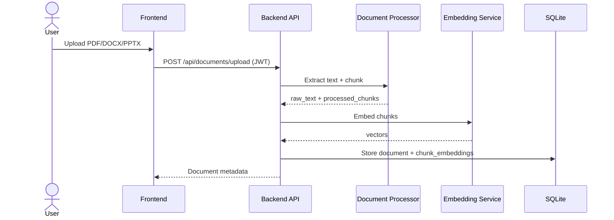
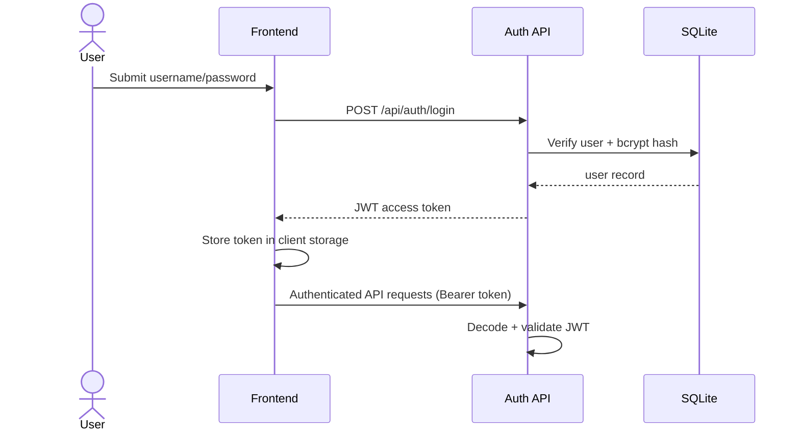
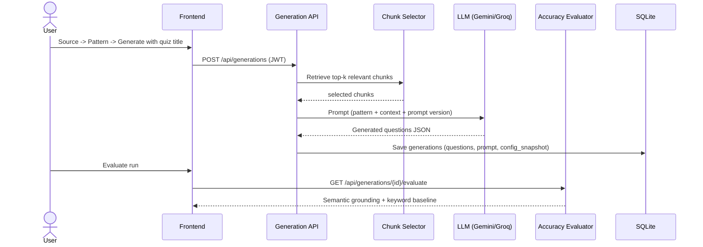
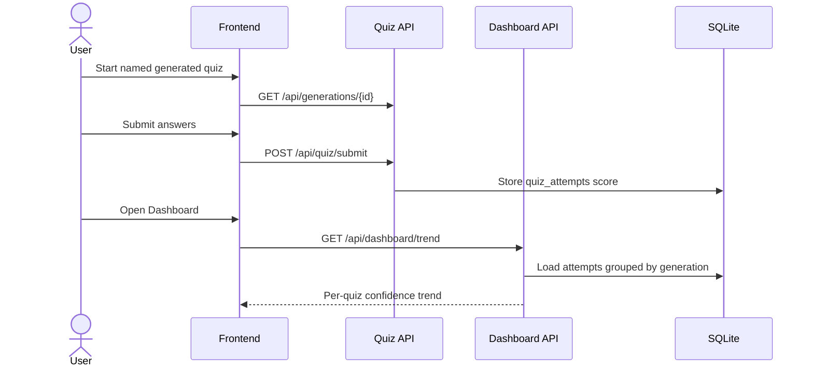

# System Architecture

## Components

- `frontend` (Next.js): authentication, guided generation wizard, quiz practice, history, dashboard.
- `backend` (FastAPI): auth/JWT, document processing, pattern extraction, generation, evaluation, usage.
- `SQLite`: users, documents, chunks/embeddings, patterns, generations, quiz_attempts, api_calls.
- `LLM services`: Gemini for generation + embeddings, Groq as generation fallback.

## Sequence: Upload Document

## Sequence: Login/JWT

## Sequence: Generate + Evaluate

## Sequence: Practice + Confidence Trend

