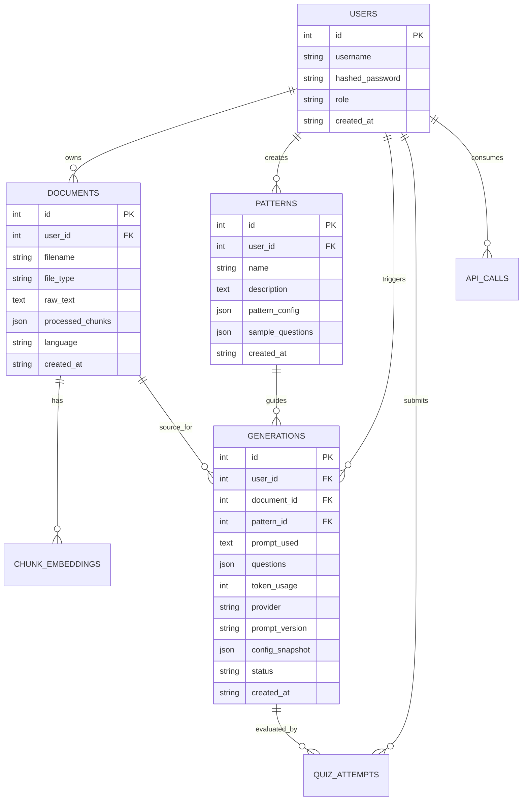

# Data Model

## Core Entities

- `users`: account identity, password hash, role.
- `documents`: uploaded source materials and processed chunks.
- `chunk_embeddings`: vectorized chunks for semantic retrieval.
- `patterns`: extracted exam templates and sample questions.
- `generations`: generated questions + prompt/config metadata for reproducibility.
- `quiz_attempts`: learner answers and score snapshots.
- `api_calls`: provider usage and token accounting.

## ER Diagram

